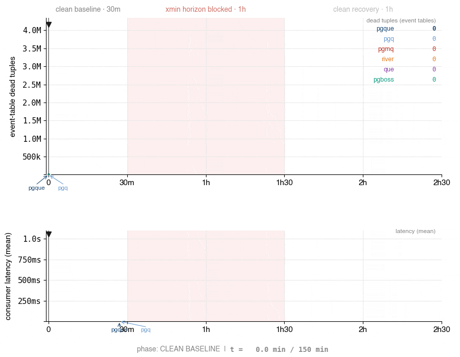
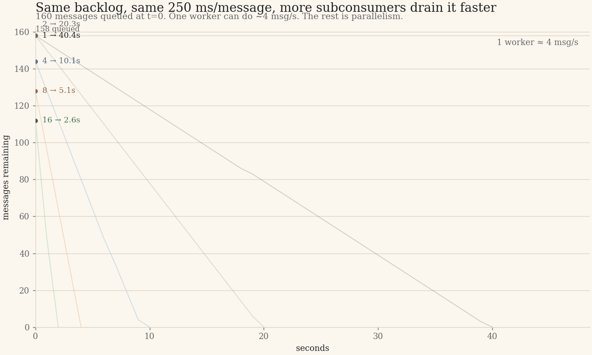

<h1 align="center">PgQue – PgQ, universal edition</h1>

<p align="center"><strong>Zero-bloat Postgres queue. One SQL file to install, <code>pg_cron</code> or <code>pg_timetable</code> to tick.</strong></p>

<p align="center">
  <a href="https://github.com/NikolayS/pgque/actions/workflows/ci.yml"></a>
  <a href="https://www.postgresql.org/"></a>
  <a href="LICENSE"></a>
  <a href="https://github.com/citusdata/pg_cron"></a>
  <a href="https://github.com/NikolayS/pgque"></a>
  <a href="https://news.ycombinator.com/item?id=47817349"></a>
</p>

<p align="center"></p>

Discussion on [Hacker News](https://news.ycombinator.com/item?id=47817349).

*For teams who want a durable event stream inside Postgres. The model is closer to Kafka (log) than to ActiveMQ or RabbitMQ (task message queue). Shared event log, independent per-consumer cursors, zero bloat under sustained load. Pure SQL and PL/pgSQL, any Postgres 14+ — managed or self-hosted, no sidecar daemon. The rest of this README walks through the history, comparison, and install paths that back up the claim.*

## Contents

- [Why PgQue](#why-pgque)
- [Latency trade-off](#latency-trade-off)
- [Three latencies](#three-latencies)
- [Comparison](#comparison)
- [Installation](#installation)
- [Roles and grants](#roles-and-grants)
- [Project status](#project-status)
- [Docs](#docs)
- [Quick start](#quick-start)
- [Client libraries](#client-libraries)
- [Benchmarks](#benchmarks)
- [Subconsumers / cooperative consumers](#subconsumers--cooperative-consumers)
- [Architecture](#architecture)
- [Roadmap](#roadmap)
- [Contributing](#contributing)
- [License](#license)

PgQue brings back [PgQ](https://github.com/pgq/pgq) — one of the longest-running Postgres queue architectures in production — in a form that runs on any Postgres platform, managed providers included.

PgQ was designed at Skype in 2006 to run messaging for hundreds of millions of users, and it ran on large self-managed Postgres deployments for over a decade. Standard PgQ depends on a C extension (`pgq`) and an external daemon (`pgqd`), neither of which runs on most managed Postgres providers.

PgQue rebuilds that battle-tested engine in pure PL/pgSQL, so the zero-bloat queue pattern works anywhere you can run SQL — without adding another distributed system to your stack.

It is the same engine – PgQ – repackaged for managed Postgres, with client libraries for TypeScript, Python, and Go.

**The anti-extension.** Pure SQL + PL/pgSQL on any Postgres 14+ — including RDS, Aurora, Cloud SQL, AlloyDB, Supabase, Neon, and most other managed providers. No C extension, no `shared_preload_libraries`, no provider approval, no restart.

Historical context, two decks:

- [Marko Kreen (Skype), PGCon 2009 — PgQ](https://www.pgcon.org/2009/schedule/attachments/91_pgq.pdf)
- [Alexander Kukushkin (Microsoft), 2026 — Rediscovering PgQ](https://speakerdeck.com/cyberdemn/rediscovering-pgq)

External coverage:

- [PgQue: Two Snapshots and a Diff](https://thebuild.com/blog/2026/05/03/pgque-two-snapshots-and-a-diff/) by Christophe Pettus — a walkthrough of the snapshot/diff mechanism: how two consecutive tick snapshots determine event visibility and why that avoids row-level locks and dead tuple bloat.
- [HN discussion](https://news.ycombinator.com/item?id=47817349)

## Why PgQue

Most Postgres queues rely on `SKIP LOCKED` plus `DELETE` and/or `UPDATE`. That holds up in toy examples and then turns into dead tuples, VACUUM pressure, index bloat, and performance drift under sustained load.

PgQue avoids that whole class of problems. It uses **snapshot-based batching** and **TRUNCATE-based table rotation** instead of per-row deletion. The hot path stays predictable:

- **Zero bloat by design** — no dead tuples in the main queue path
- **No performance decay** — it does not get slower because it has been running for months
- **Built for heavily loaded systems** — the sustained-load regime the original PgQ architecture was designed for
- **Real Postgres guarantees** — ACID transactions, transactional enqueue/consume, WAL, backups, replication, SQL visibility
- **Works on managed Postgres** — no custom build, no C extension, no separate daemon

PgQue gives you queue semantics **inside** Postgres, with Postgres durability and transactional behavior, without the bloat tax most in-database queues eventually hit.

## Latency trade-off

PgQue is built around **snapshot-based batching**, not row-by-row claiming. That's what gives it zero bloat in the hot path, stable behavior under sustained load, and clean ACID semantics inside Postgres.

The trade-off is **end-to-end delivery latency** — the gap between `send` and when a consumer can `receive` the event. PgQue ticks **10 times per second** (every 100 ms) by default, so the wait for the next tick is about half the tick period on average. A committed benchmark ([`benchmark/tick-rate/`](https://github.com/NikolayS/pgque/tree/main/benchmark/tick-rate)) measures median end-to-end delivery around 52 ms at the default 100 ms tick, with a max of roughly one tick period (about 105–145 ms across the committed runs), plus the consumer's poll interval. The `send` / `receive` / `ack` calls themselves are individually fast. See [docs/latency-and-tuning.md](docs/latency-and-tuning.md) for the full breakdown.

Ways to reduce delivery latency: tune the tick period (for example `pgque.set_tick_period_ms(50)` for 20 ticks/sec; accepted periods are exact divisors of 1000 ms) and queue thresholds; use `force_next_tick()` for tests and demos or to force an immediate batch. Future versions may add logical-decoding-based wake-ups for sub-millisecond delivery without burning more WAL on ticking.

If your top priority is single-digit-millisecond dispatch, PgQue is the wrong tool. If your priority is **stability under load without bloat**, that is where PgQue fits.

## Three latencies

"Queue latency" is three numbers, not one:

1. **Producer latency** — `send` / `insert_event`. Individually fast.
2. **Subscriber latency** — `next_batch` over a pre-built batch. Individually fast.
3. **End-to-end delivery** — `send` → consumer visibility. About half the tick period on average (default 100 ms tick), measured at a median around 52 ms in the committed [`benchmark/tick-rate/`](https://github.com/NikolayS/pgque/tree/main/benchmark/tick-rate) benchmark. Tunable from 1 ms to 1000 ms via `pgque.set_tick_period_ms(ms)`. Does not grow with load.

See [docs/latency-and-tuning.md](docs/latency-and-tuning.md) for the breakdown, tick-cadence trade-off table, and comparison with UPDATE/DELETE-based designs.

## Comparison

| Feature | PgQue | PgQ | PGMQ | River | Que | pg-boss |
|---|---|---|---|---|---|---|
| Snapshot-based batching (no row locks) | ✅ | ✅ | ❌ | ❌ | ❌ | ❌ |
| Zero bloat under sustained load | ✅ | ✅ | ❌ | ❌ | ❌ | ❌ |
| No external daemon or worker binary | ✅ | ❌ | ✅ | ❌ | ❌ | ❌ |
| Pure SQL install, managed Postgres ready | ✅ | ❌ | ✅ | ✅ | ✅ | ✅ |
| Language-agnostic SQL API | ✅ | ✅ | ✅ | ❌ | ❌ | ❌ |
| Shared-log fan-out: each consumer sees every event | ✅ | ✅ | ❌ | ❌ | ❌ | ⚠️ |
| Built-in retry with backoff | ✅ | ✅ | ⚠️ | ✅ | ✅ | ✅ |
| Built-in dead letter queue | ✅ | ❌ | ⚠️ | ⚠️ | ❌ | ✅ |

**Legend:** ✅ yes · ❌ no · ⚠️ partial / indirect

**Notes:**

- **[PgQ](https://github.com/pgq/pgq)** is the Skype-era queue engine (~2007) PgQue is derived from. Same snapshot/rotation architecture, but requires C extensions and an external daemon (`pgqd`) — unavailable on managed Postgres. PgQue removes both constraints.
- **No external daemon:** PgQue uses pg_cron (or your own scheduler) for ticking; PGMQ uses visibility timeouts. River, Que, and pg-boss require a Go / Ruby / Node.js worker binary.
- **[Que](https://github.com/que-rb/que)** uses advisory locks (not SKIP LOCKED) — no dead tuples from *claiming*, but completed jobs are still DELETEd. Brandur's [bloat post](https://brandur.org/postgres-queues) was about Que at Heroku. Ruby-only.
- **PGMQ retry** is visibility-timeout re-delivery (`read_ct` tracking) — no configurable backoff or max attempts.
- **PGMQ consumers:** PGMQ supports multiple producers and multiple competing consumers/workers. The `❌` in the fan-out row means it does not provide PgQ-style independent consumer cursors where every registered consumer receives every event from a shared log.
- **pg-boss fan-out** is copy-per-queue `publish()`/`subscribe()`, not a shared event log with independent cursors.
- **Category:** River, Que, and pg-boss (and Oban, graphile-worker, solid_queue, good_job) are **job queue frameworks**. PgQue is an **event/message queue** optimized for high-throughput streaming with fan-out.

### What differentiates PgQue

**1. Zero event-table bloat, by design.** SKIP LOCKED queues (PGMQ, River, pg-boss, Oban, graphile-worker) UPDATE + DELETE rows, creating dead tuples that require VACUUM. Under sustained load this causes documented failures:

- [Brandur/Heroku (2015)](https://brandur.org/postgres-queues) — 60k backlog in one hour.
- [PlanetScale (2026)](https://planetscale.com/blog/keeping-a-postgres-queue-healthy) — death spiral at 800 jobs/sec with OLAP on the side.
- [River issue #59](https://github.com/riverqueue/river/issues/59) — autovacuum starvation.

Oban Pro shipped table partitioning to mitigate it; PGMQ ships aggressive autovacuum settings. PgQue's TRUNCATE rotation creates zero dead tuples by construction. No tuning. Immune to xmin horizon pinning.

**2. Native fan-out.** Each registered consumer maintains its own cursor on a shared event log and independently receives all events. That is different from the competing-consumers model (SKIP LOCKED), where each job goes to one worker. pg-boss has fan-out but it is copy-per-queue (one INSERT per subscriber per event). PgQue's model is a position on a shared log — no data duplication, atomic batch boundaries, late subscribers catch up. Closer to Kafka topics than to a job queue.

### When to use PgQue vs. a job queue

- **Choose PgQue** when you want event-driven fan-out, no bloat to tune around, and a language-agnostic SQL API, and you do not need per-job priorities or a worker framework.
- **Choose a job queue** when you need per-job lifecycle, sub-3ms latency, priority queues, cron scheduling, unique jobs, or deep ecosystem integration (Elixir/Go/Node.js/Ruby).

## Installation

**Requirements:** Postgres 14+, and something that calls `pgque.ticker()` periodically. With `pg_cron`, `pgque.start()` schedules a single 1-second `pg_cron` slot that internally re-ticks every **100 ms (10 ticks/sec)** by default — see [Tick rate](#tick-rate) for tuning. `pg_cron` is pre-installed or one-command available on all major managed Postgres providers (RDS, Aurora, Cloud SQL, AlloyDB, Supabase, Neon); on self-managed Postgres, follow the [pg_cron setup guide](https://github.com/citusdata/pg_cron#setting-up-pg_cron). Any external scheduler (system `cron`, systemd, a worker loop in your app) works as an alternative — see below.

> Want to try an upcoming release early? The in-development install lives in
> [`devel/sql/`](devel/sql/README.md). The steps below install the stable version.

Get the source — `\i sql/pgque.sql` resolves relative to the cwd, so run psql from the repo root:

```bash
git clone https://github.com/NikolayS/pgque
cd pgque
```

Inside a psql session:

```sql
begin;
\i sql/pgque.sql
commit;
```

Or from the shell, same single-transaction guarantee via `psql --single-transaction`:

```bash
PAGER=cat psql --no-psqlrc --single-transaction -d mydb -f sql/pgque.sql
```

With `pg_cron` available in the same database as PgQue, `pgque.start()` creates the default ticker and maintenance jobs. The ticker uses a one-second pg_cron slot and calls `pgque.ticker_loop()`, which ticks every 100 ms by default (10 ticks/sec) with a commit between ticks:

```sql
select pgque.start();
```

With `pg_timetable`, run the external pg_timetable worker against the database where PgQue is installed, then schedule PgQue with the same 10 ticks/sec default. For example:

```bash
pg_timetable --dbname=mydb --clientname=pgque
```

The `--clientname=pgque` flag is required; pg_timetable only executes chains whose `job_client_name` matches the running worker's client name. Keep that worker running; unlike `pg_cron`, pg_timetable is an external scheduler process, not a Postgres extension background worker. See the [pg_timetable docs](https://github.com/cybertec-postgresql/pg_timetable) for production service setup.

```sql
select pgque.start_timetable();      -- default: 10 ticks/sec
-- or explicitly:
select pgque.start_timetable(10);
```

`pgque.stop_timetable()` removes the PgQue pg_timetable jobs. `pgque.stop()` also stops whichever PgQue scheduler is active. Calling `pgque.start_timetable()` automatically removes existing PgQue `pg_cron` jobs first; `pgque.start()` does the same for PgQue pg_timetable jobs. `pgque.set_tick_period_ms(ms)` still controls the loop cadence; for example `100` means 10 ticks/sec, `200` means 5 ticks/sec, and `1000` means 1 tick/sec.

### Tick rate

PgQue ticks **10 times per second by default** (every 100 ms), even though `pg_cron`'s minimum schedule is 1 second. `pgque.start()` schedules a single 1-second pg_cron slot that calls `CALL pgque.ticker_loop()`; `pgque.start_timetable()` schedules the same loop through one pg_timetable `@every 1 second` job. The procedure then re-invokes `pgque.ticker()` every `tick_period_ms` ms inside that slot, committing between iterations so each tick gets its own transaction (snapshot semantics; bounded held-xmin so rotation isn't blocked).

Tune at runtime — no need to call `start()` again; the change picks up on the next scheduler slot (≤1 s):

```sql
select pgque.set_tick_period_ms(50);    -- 20 ticks/sec
select pgque.set_tick_period_ms(10);    -- 100 ticks/sec (~8 ms median e2e, benchmark/tick-rate/)
select pgque.set_tick_period_ms(1000);  -- 1 tick/sec, the pgqd-compatible cadence
```

Allowed values: exact divisors of `1000` in the `1`..`1000` ms range. Inspect the current rate with `select * from pgque.status();`.

Trade-offs to keep in mind when raising the rate:
- **Idle queues are cheap.** The 100 ms default is the *check cadence*, not a promise to write 10 ticks/sec forever. With no producer writes, most ticker calls return `NULL`; PgQue backs off toward `ticker_idle_period` (default 1 minute), so inactive queues produce occasional metadata writes rather than a steady tick stream. Continuous WAL cost applies only to queues that actually materialize ticks every period. See [docs/latency-and-tuning.md](docs/latency-and-tuning.md) for caveats and tuning guidance.
- **NOTIFY rate.** `pgque.ticker()` emits `pg_notify('pgque_<queue>', ...)` per tick. Postgres's NOTIFY queue is global (8 GiB SLRU); slow LISTEN consumers can fall behind at very high rates.
- **Metadata-table dead tuples.** `pgque.tick` and `pgque.subscription` are UPDATEd on every tick. PgQue rotates these tables to keep dead-tuple peaks bounded; at sub-50 ms tick periods, drop the rotation period proportionally.
- **`pg_cron` background workers.** `pgque.ticker_loop()` holds one pg_cron worker for the full ~1 s slot. With pg_cron's default `cron.max_running_jobs = 32`, the number of pgque-bearing databases sharing one cluster is bounded by the worker pool. Not a per-database concern; matters if you fan PgQue across many databases on one instance.

**pg_cron in a different database.** `pg_cron` runs jobs in one designated database (`cron.database_name`, typically `postgres`). If your PgQue schema lives in a different database, use the [cross-database pattern](https://github.com/citusdata/pg_cron#creating-a-cron-job-in-a-different-database) to call `pgque.ticker_loop()`, `pgque.maint_retry_events()`, and `pgque.maint()` across databases. *Todo: a future release will detect this and emit the correct `cron.schedule_in_database` calls from `pgque.start()` automatically.*

**Scheduler log hygiene.** Every `pg_cron` job execution writes a row to `cron.job_run_details`, with no built-in purge. PgQue's internal sub-second loop does **not** make this worse — there is still only **one** `pg_cron` slot per second per job, regardless of `tick_period_ms`, so the per-second row count is the same as a 1 tick/sec schedule. Across PgQue's four scheduled jobs (ticker every 1 s, retry every 30 s, maint every 30 s, rotate_step2 every 10 s), those rows accumulate on top of any other pg_cron jobs and grow forever unless you intervene. Prefer a PgQue-specific purge job; disable `cron.log_run` globally only if you do not need successful-run history for any pg_cron jobs. See [Latency and tick tuning](docs/latency-and-tuning.md#pg_cron-log-hygiene) for the purge recipe. *(Independent issue: `pg_cron` itself has no per-job log toggle as of 1.6.)* If you use pg_timetable, monitor and purge pg_timetable's own execution history tables according to its retention policy; PgQue does not manage those logs.

Without `pg_cron` or `pg_timetable`, PgQue still installs. Drive ticking and maintenance from your application or an external scheduler:

```bash
PAGER=cat psql --no-psqlrc -d mydb -c "select pgque.ticker()"              # at your chosen tick period
PAGER=cat psql --no-psqlrc -d mydb -c "select pgque.maint_retry_events()"  # every 30 seconds
PAGER=cat psql --no-psqlrc -d mydb -c "select pgque.maint()"               # every 30 seconds
```

For sub-second ticking from an external driver, loop `pgque.ticker()` at your target rate; `tick_period_ms` is only consulted by `pgque.ticker_loop()` (the pg_cron path).

**Important:** PgQue does not deliver messages without a working ticker. Enqueueing still works, but consumers will see nothing new because no ticks are created. If you do not use `pg_cron`, run `pgque.ticker()`, `pgque.maint_retry_events()`, and `pgque.maint()` yourself. Skipping `maint_retry_events()` means nack'd events will never be redelivered.

For existing installs, follow the SQL-file upgrade procedure in [docs/installation.md](docs/installation.md#upgrading). To uninstall: `\i sql/pgque_uninstall.sql`.

### Optional: install as a [`pg_tle`](https://github.com/aws/pg_tle) extension

This is opt-in. The default `\i sql/pgque.sql` install stays the recommended path; use pg_tle only if you specifically want PgQue managed as a real Postgres extension.

What you get with pg_tle: `pg_extension` membership, `alter extension pgque update` for version upgrades, and `drop extension pgque cascade` for atomic uninstall. What you give up: pg_tle is itself a C extension preloaded via `shared_preload_libraries`, which is the dependency the default install avoids. Available on AWS RDS / Aurora and self-hosted Postgres; check your provider's extension list otherwise.

**Prerequisites.** Run the installer as a role that holds `pgtle_admin` plus `CREATEROLE` (Postgres roles are cluster-global, so the wrapper creates `pgque_reader` / `pgque_writer` / `pgque_admin` outside the TLE body). pg_tle must also be in `shared_preload_libraries`. On managed providers, set this via the parameter group / cluster config UI and reboot. On self-hosted Postgres, **append** `pg_tle` to the existing list — overwriting it disables anything else you preload (e.g. `pg_cron`):

```sql
show shared_preload_libraries;                                -- inspect current list first
alter system set shared_preload_libraries = 'pg_cron,pg_tle'; -- preserve existing entries
-- restart Postgres, then in the target database:
create extension pg_tle;
```

Once pg_tle is loaded, register and create PgQue:

```sql
\i sql/pgque-tle.sql
create extension pgque;
```

To uninstall: `\i sql/pgque-tle-uninstall.sql`.

## Roles and grants

The install creates three roles. Application users do not need superuser — grant them whichever role matches their access pattern.

PgQue mirrors upstream PgQ's split: `pgque_reader` (consume) and `pgque_writer` (produce) are **siblings**, not parent/child. `pgque_admin` is a member of both. Apps that produce **and** consume must be granted both roles explicitly.

| Role | Purpose | Granted access |
|---|---|---|
| `pgque_reader` | Consumers, dashboards, metrics, debugging | Read-only info (`get_queue_info`, `get_consumer_info`, `get_batch_info`, `version`, `select` on all tables) **and** the consume API (`subscribe`, `unsubscribe`, `receive`, `ack`, `nack`) plus the underlying PgQ primitives (`next_batch*`, `get_batch_events`, `finish_batch`, `event_retry`, `register_consumer*`, `unregister_consumer`) and the [experimental cooperative consumer functions](docs/reference.md#cooperative-consumers--subconsumers). |
| `pgque_writer` | Producers | The produce API (`send`, `send_batch`) and the underlying primitive (`insert_event`). Does **not** inherit `pgque_reader` — a producer-only role cannot ack/finish/inspect consumer batches. |
| `pgque_admin`  | Operators, migrations | Member of both `pgque_reader` and `pgque_writer`, plus full schema/table/sequence access. `uninstall()` is revoked from both `pgque_admin` and PUBLIC (superuser-only — it drops the schema). |

Typical app setup:

```sql
\i sql/pgque.sql
select pgque.start();                     -- optional pg_cron ticker + maint

-- Produce + consume in the same app: grant BOTH roles.
create user app_orders with password '...';          -- replace with a real password
grant pgque_reader to app_orders;
grant pgque_writer to app_orders;

-- Pure producer (e.g. a webhook ingester that only sends).
create user app_webhook with password '...';
grant pgque_writer to app_webhook;

-- Pure consumer / dashboard / metrics.
create user metrics with password '...';              -- replace with a real password
grant pgque_reader to metrics;
```

DDL-class operations (`create_queue`, `drop_queue`, `start`, `stop`, `maint`, `maint_retry_events`, `ticker`, `force_next_tick`, `set_queue_config`) are not granted to either `pgque_reader` or `pgque_writer`. The schema-wide blanket `revoke execute … from public` strips PUBLIC, and `pgque_admin` is the only role that retains `execute` on these helpers — perform them as an admin / migration role.

**Roles are global, not per-queue.** A `pgque_reader` granted to an app can ack any consumer's batch and read any other consumer's active batch payloads. Do not grant `pgque_reader` to mutually untrusted applications sharing one database unless you add your own schema-level or database-level isolation. See [docs/reference.md — Roles scope](docs/reference.md#roles-are-global-not-per-queue) for details and recommended isolation patterns.

## Project status

PgQue is **early-stage** as a product and API layer. PgQ itself has run at Skype scale for over a decade. What's new here is the packaging, modernization, managed-Postgres compatibility, and the higher-level PgQue API around that core.

The default install stays small; additional APIs live under [`devel/sql/experimental/`](https://github.com/NikolayS/pgque/tree/main/devel/sql/experimental) until they are worth promoting. See [blueprints/PHASES.md](blueprints/PHASES.md).

## Docs

- [Tutorial](docs/tutorial.md) — a hands-on walkthrough. Start here if you are new.
- [Installation and operations](docs/installation.md) — install, ticking, role grants, upgrading, uninstall, troubleshooting.
- [Examples](docs/examples.md) — patterns: fan-out, exactly-once, batch loading, recurring jobs.
- [Monitoring and health](docs/monitoring.md) — queue, consumer, and batch info views.
- [Function reference](docs/reference.md) — every shipped function and role.
- [Latency and tick tuning](docs/latency-and-tuning.md) — latency breakdown, tick-cadence trade-offs, idle tick behavior, and pg_cron logging caveats.
- [Concepts and heritage](docs/concepts.md) — batch/tick/rotation glossary, the snapshot/diff engine, and where this engine came from.

## Quick start

```sql
-- tx 1: create queue + consumer
select pgque.create_queue('orders');
select pgque.subscribe('orders', 'processor');

-- tx 2: send a message
select pgque.send('orders', '{"order_id": 42, "total": 99.95}'::jsonb);

-- tx 3: advance the queue if you are not using pg_cron
-- force_next_tick bumps the event-seq threshold; ticker() then inserts the tick.
-- Each select below is its own implicit transaction in psql autocommit —
-- do NOT wrap these in begin/commit (the tick must see the send committed).
select pgque.force_next_tick('orders');
select pgque.ticker();

-- tx 4: receive — every returned row carries the same batch_id
select * from pgque.receive('orders', 'processor', 100);
--  msg_id | batch_id |  type   |             payload              | retry_count | ...
-- --------+----------+---------+----------------------------------+-------------+----
--       1 |        1 | default | {"total": 99.95, "order_id": 42} |             |
-- (jsonb sorts object keys by length then alphabetically, so the input
--  '{"order_id": 42, "total": 99.95}' comes back with "total" first)

-- tx 5: ack the batch_id from the previous result
select pgque.ack(1);
```

Send, tick, and receive **must** run in separate transactions — that's a hard requirement of PgQ's snapshot-based design, not a recommendation. A `tick` records a snapshot of committed transaction IDs; a `send` in the same xact is still in progress at that moment and gets excluded from the next batch's visibility window, so the event never surfaces. In normal operation, `pg_cron` or an external scheduler drives `pgque.ticker()`; `force_next_tick()` is mainly for demos, tests, and manual operation. In application code, capture `batch_id` from any returned row and pass it to `ack`.

The scriptable psql idiom (replaces tx 4 + tx 5 above):

```sql
select batch_id from pgque.receive('orders', 'processor', 100) limit 1 \gset
select pgque.ack(:batch_id);
```

Longer walkthrough in the [tutorial](docs/tutorial.md); patterns like fan-out, exactly-once, and recurring jobs in [examples](docs/examples.md).

## Client libraries

PgQue is SQL-first, so any Postgres driver works. First-party client libraries live in this repo for **Python**, **Go**, and **TypeScript** (all published at `v0.2.0`), plus **Ruby**, shipping in v0.3.

### Python (`pgque-py`) — psycopg 3

```bash
pip install pgque-py
```

```python
from pgque import Consumer, connect

with connect("postgresql://localhost/mydb") as client:
    client.send("orders", {"order_id": 42}, type="order.created")
    client.conn.commit()

consumer = Consumer(
    "postgresql://localhost/mydb",
    queue="orders",
    name="processor",
)

@consumer.on("order.created")
def handle_order(msg):
    process_order(msg.payload)

consumer.start()
```

### Go (`github.com/NikolayS/pgque-go`) — pgx/v5

```bash
go get github.com/NikolayS/pgque-go@v0.2.0
```

```go
client, _ := pgque.Connect(ctx, "postgresql://localhost/mydb")
defer client.Close()

_, _ = client.Send(ctx, "orders", pgque.Event{
    Type:    "order.created",
    Payload: map[string]any{"order_id": 42},
})

consumer := client.NewConsumer("orders", "processor")
consumer.Handle("order.created", func(ctx context.Context, msg pgque.Message) error {
    return processOrder(msg)
})
consumer.Start(ctx)
```

### TypeScript (`pgque`) — node-postgres

```bash
npm install pgque        # or: bun add pgque
```

```ts
import { connect } from 'pgque';

const client = await connect('postgresql://localhost/mydb');
try {
  await client.send('orders', {
    type: 'order.created',
    payload: { order_id: 42 },
  });
  await client.subscribe('orders', 'processor');

  const messages = await client.receive('orders', 'processor', 100);
  if (messages.length > 0) await client.ack(messages[0]!.batchId);
} finally {
  await client.close();
}
```

### Ruby (`pgque`) — pg gem

```bash
gem install pgque --pre        # or pin: gem "pgque", "0.3.0.rc.1"
```

```ruby
require "pgque"

Pgque.connect("postgresql://localhost/mydb") do |client|
  # one-time setup (typically in a migration)
  client.conn.exec("select pgque.create_queue('orders')")
  client.conn.exec("select pgque.subscribe('orders', 'processor')")

  client.send("orders", { "order_id" => 42 }, type: "order.created")
end

consumer = Pgque::Consumer.new(
  "postgresql://localhost/mydb",
  queue: "orders",
  name: "processor",
)
consumer.on("order.created") { |msg| process_order(msg.payload) }
consumer.start  # blocks until SIGTERM/SIGINT; needs pgque.ticker() running
```

### Any language

```sql
select pgque.send('orders', '{"order_id": 42}'::jsonb);

-- without pg_cron, advance the queue manually (omit if a ticker is running).
-- Run as separate transactions — do not wrap in begin/commit.
select pgque.force_next_tick('orders');
select pgque.ticker();

-- receive returns rows; every row carries the same batch_id
select * from pgque.receive('orders', 'processor', 100);

-- ack the batch_id from any returned row (capture it in the driver)
select pgque.ack(1);  -- replace with the batch_id from above
```

## Benchmarks

The headline result is **zero bloat under a pinned xmin horizon** — the worst
case for SKIP LOCKED queues. A committed benchmark ([`benchmark/xmin-horizon/`](https://github.com/NikolayS/pgque/tree/main/benchmark/xmin-horizon),
with reproducer and raw results) holds an xmin and compares a SKIP LOCKED queue
against PgQue. Under the held xmin, the SKIP LOCKED queue's dead tuples grow
about **14×**, its table size about **15×**, and dequeue throughput drops about
**35%**; PgQue keeps **`n_dead_tup = 0` across all `pgque.event_*` tables** and
its throughput is unchanged. See [docs/concepts.md](docs/concepts.md) for the
full comparison table and methodology.

Cross-system measurements and reproducers live in [`benchmark/`](https://github.com/NikolayS/pgque/tree/main/benchmark).
Numbers there are for reference and exploration, not a final verdict —
benchmarking Postgres queues is hard (cf. Brendan Gregg) and the
methodology continues to evolve.

The cooperative-consumer demo harness lives in
[`benchmark/subconsumer-scaling/`](https://github.com/NikolayS/pgque/tree/main/benchmark/subconsumer-scaling). It fixes the
per-message downstream work and varies only consumer parallelism, so the
scaling story is easy to see without mixing in producer cadence or tick tuning.

## Subconsumers / cooperative consumers

This is the use case that keeps coming up: the queue itself is fast, but the
downstream side effect is not. If one message means one transactional email API
call (Resend, SendGrid), one SMS request, one webhook, or one slow HTTP POST,
then consumer-side parallelism is what decides whether the backlog drains or
lingers.

Cooperative consumers ship in the default install but are **experimental in
0.2** (the functions carry runtime "Experimental in PgQue 0.2" markers). PgQue
does not need a second queue to show the effect. One main consumer fetches a
batch and fans the work out to a pool of subconsumers, each pulling its own
slice cooperatively. To make the point concrete, the demo harness preloads the
same backlog every time and replaces the email-provider call with a fixed
per-message sleep — an intentional stand-in for a service like Resend or
SendGrid — then increases only the number of subconsumers.

<p align="center"></p>

The takeaway is qualitative: when downstream work dominates, a single consumer
is throughput-bound by that work, and adding cooperative subconsumers scales
throughput and backlog drain nearly linearly until some other bottleneck
shows up. The harness above lets you reproduce that on your own hardware.

## Architecture

PgQue keeps PgQ's proven core architecture — snapshot-based batch isolation, three-table TRUNCATE rotation on the hot path, separate retry / delayed / dead-letter tables, and independent per-consumer cursors — and adds a modern API layer on top. See [blueprints/SPECx.md](blueprints/SPECx.md) for the full specification and [docs/concepts.md](docs/concepts.md) for the batch/tick/rotation glossary.

## Roadmap

| Feature | Done |
|---|---|
| PgQ core engine | ✅ |
| Modern Postgres support (14-19) | ✅ |
| Pure SQL / PL/pgSQL install | ✅ |
| Managed Postgres support | ✅ |
| No daemon / no C extension | ✅ |
| `pg_cron`, `pg_timetable`, or external ticking | ✅ |
| Sub-second ticking with `pg_cron` (default 10 ticks/sec, tunable) | ✅ |
| System-table rotation / bloat mitigation |  |
| [Cooperative consumers / subconsumers](#subconsumers--cooperative-consumers) | 🔬 experimental |
| Queue splitter |  |
| Queue mover |  |
| Modern `send`, `receive`, `ack`, `nack` API | ✅ |
| `send_batch` API | ✅ |
| Improved `send_batch` performance | ✅ |
| Dead-letter queue after retry limit | ✅ |
| Go library | ✅ |
| TypeScript library | ✅ |
| Python library | ✅ |
| Rust library |  |
| Java library |  |
| Ruby library |  |
| Basic queue/consumer info views | ✅ |
| Advanced observability / health views |  |
| LISTEN/NOTIFY consumer wakeups on tick |  |
| Delayed / scheduled delivery (`send_at`) |  |
| Queue config JSON API |  |
| Queue pause / resume |  |
| OpenTelemetry / Prometheus metrics export |  |
| Admin CLI |  |
| Cross-database `pg_cron` scheduling |  |
| Message TTL / expiry |  |
| Per-tenant isolation / multi-schema installs |  |
| `pg_tle` extension package | ✅ |
| Migration guides |  |

## Contributing

See [CONTRIBUTING.md](CONTRIBUTING.md) for contribution guidelines.

See [blueprints/SPECx.md](blueprints/SPECx.md) for the specification and implementation plan. New code should follow red/green TDD: write the failing test first, then fix it. Agents and AI coding tools should also read [CLAUDE.md](CLAUDE.md).

## License

Apache-2.0. See [LICENSE](LICENSE).

PgQue includes code derived from [PgQ](https://github.com/pgq/pgq) (ISC license, Marko Kreen / Skype Technologies OU). See [NOTICE](NOTICE).
