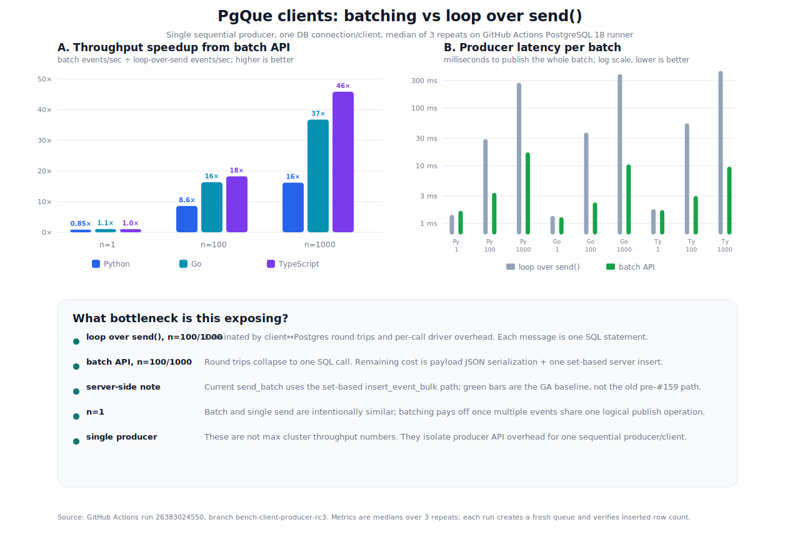

# Benchmarks

## Queues under blocked xmin horizon

The most common operational failure mode of `SELECT ... FOR UPDATE SKIP LOCKED`
queues isn't slow throughput in a clean lab — it's silent degradation in
production when xmin horizon is held by a long-running transaction or an
unconsumed logical replication slot. Causes are routine: long REPEATABLE READ
transactions, `pg_dump`, idle logical replication slots,
`hot_standby_feedback=on` with a slow replica. While xmin is held, VACUUM
cannot reclaim the dead tuples generated by the queue's `INSERT → UPDATE →
DELETE` lifecycle, the queue table bloats, and read latency climbs.

`benchmark/xmin-horizon/` reproduces this failure mode and contrasts a generic
SKIP LOCKED queue with pgque's TRUNCATE-rotation model. PG17, 4 producers
+ 4 consumers + 2 bystander clients on an unrelated 1M-row table, 800
enqueues/s, 3-minute runs, aggressive autovacuum
(`autovacuum_vacuum_scale_factor = 0.005`, `autovacuum_naptime = 10s`).

| Scenario | Workload | Dequeue (jobs/s) | n_dead_tup | Table size | Bystander avg lat |
|---|---|---:|---:|---:|---:|
| baseline | SKIP LOCKED | 797 | 6,397 | 1.0 MiB | 1.35 ms |
| baseline | pgque | 792 | 0 | 13.4 MiB (live events) | 1.50 ms |
| RR holds xmin | SKIP LOCKED | **517** | **91,593** | **15.1 MiB** | **2.05 ms** |
| RR holds xmin | pgque | 804 | **0** | 27.0 MiB (live events) | 1.45 ms |

When xmin is blocked, the SKIP LOCKED queue's dead tuple count grows by
**14×**, table size by **15×**, dequeue throughput drops by **~35%**, and
bystander query latency on an unrelated table sharing buffer cache rises
by **~50%**. pgque is unaffected — `n_dead_tup = 0` across all
`pgque.event_*` tables in every cell, throughput and bystander latency
unchanged from baseline.

Reproducer + raw 5-second metrics: [`benchmark/xmin-horizon/`](../benchmark/xmin-horizon/).
Spec: [`blueprints/BENCH_XMIN_HORIZON.md`](../blueprints/BENCH_XMIN_HORIZON.md).

## Client producer batching

First-party client producer microbenchmarks compare a sequential loop over
`send()` with one `send_batch()` call. Environment: GitHub Actions
`ubuntu-latest`, PostgreSQL 18 Docker image, one producer/client connection,
median of 3 repeats. Raw data:
[`benchmark/charts/client_producer_batch_api.csv`](../benchmark/charts/client_producer_batch_api.csv).

| Client | Batch size | `send()` loop | `send_batch()` | Speedup |
|---|---:|---:|---:|---:|
| Python | 100 | 3,766 ev/s | 32,316 ev/s | 8.6× |
| Python | 1000 | 3,963 ev/s | 64,156 ev/s | 16.2× |
| Go | 100 | 2,912 ev/s | 47,535 ev/s | 16.3× |
| Go | 1000 | 2,824 ev/s | 103,811 ev/s | 36.8× |
| TypeScript | 100 | 2,009 ev/s | 36,650 ev/s | 18.2× |
| TypeScript | 1000 | 2,476 ev/s | 113,530 ev/s | 45.9× |

The point is not max cluster throughput. This isolates API overhead for a
single sequential producer: loop-over-send is round-trip-bound; `send_batch()`
collapses the operation into one SQL call and now uses PgQue's set-based
`insert_event_bulk` path.

## Steady-state throughput

Preliminary results on a laptop (Apple Silicon, 10 cores, 24 GiB RAM,
PostgreSQL 18.3, `synchronous_commit=off`). Full methodology:
[NikolayS/pgq#1](https://github.com/NikolayS/pgq/issues/1).

| Scenario | Throughput | Per core |
|---|---|---|
| PL/pgSQL single insert/TX, ~100 B, 16 clients | **85,836 ev/s** | ~8.6k ev/s |
| PL/pgSQL batched 100k/TX, ~100 B | 80,515 ev/s | ~8.1k ev/s |
| PL/pgSQL batched 100k/TX, ~2 KiB | 48,899 ev/s (91.5 MiB/s) | ~4.9k ev/s |
| Consumer read rate, 100k batch, ~100 B | ~2.4M ev/s | ~240k ev/s |
| Consumer read rate, 100k batch, ~2 KiB | ~305k ev/s (568 MiB/s) | ~30.5k ev/s |

Key takeaways:

- **Zero bloat under load** — a 30-minute sustained test: zero
  dead-tuple growth in event tables.
- **Batching matters** — throughput jumps sharply when you stop doing one
  tiny transaction per event.
- **Consumer side is not the bottleneck** — reads are much faster than writes.
- **Full Postgres guarantees** — transactional semantics, WAL durability
  options, backups, replication, SQL introspection.

> `synchronous_commit=off` can be set per session or per transaction for
> queue-heavy workloads if that trade-off makes sense for your system.

These numbers are preliminary, from a single laptop.
